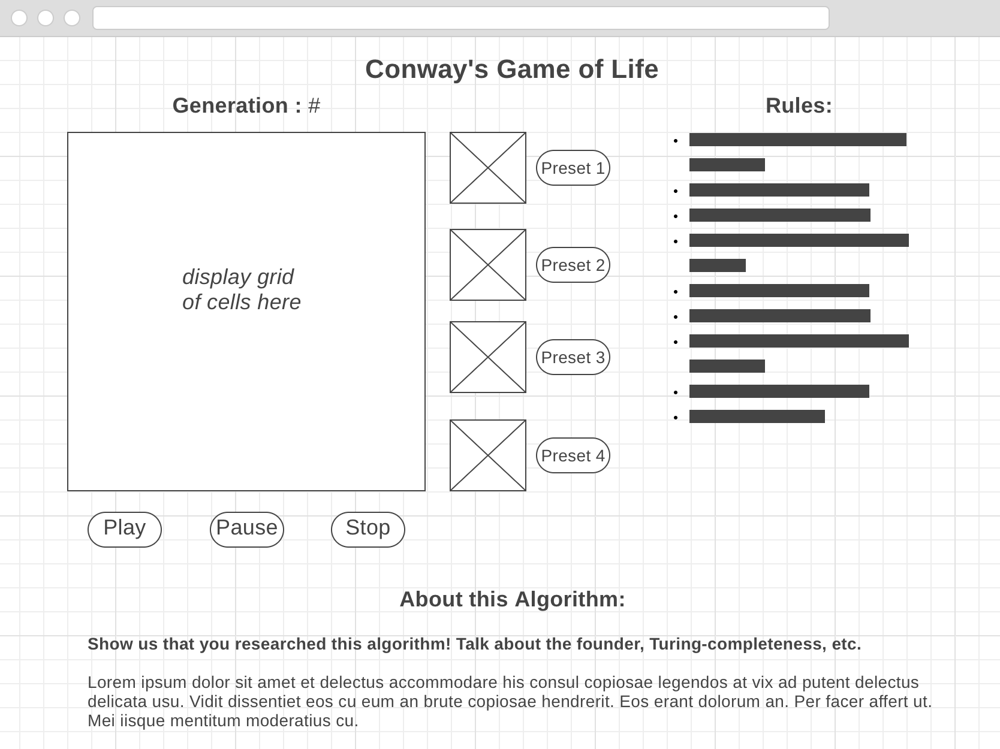

# Cellular Automata and Conway's "Game of Life"

Over the course of this week, students will work on creating their own application in which users will be able to run different "Game of Life" scenarios. This module leads the reader through the fundamentals of Conways's "Game of Life" and will guide them through the process of creating an app utilizing tools and frameworks that have been taught over the course of their specific track.

## Objectives
* Student should be able to create a unique, high-quality project that can be added to a professional portfolio
* [Student should be able to describe the rules of Conway’s “Game of Life”](objectives/rules-game-life)
* [Student should be able to explain what cellular automata are and describe how they are useful in real life](objectives/explain-describe-ca)
* [Student should be able to correctly analyze the ‘Turing Completeness’ of Conway’s “Game of Life”](objectives/turing-complete)
* [Student should be able to implement a visualization of Conway’s “Game of Life” using technologies related to their specific track](objectives/visualization)
* [Student should be able to utilize “double buffering” to implement animations](objectives/double-buffer)

## Git Commits

- You are required to showcase progress with at least 1 commit a day.
  This will let your project manager know where you are and if you need
  help. This also allows the client to get progress reports from the
  company in a real world setting.

## Trello Set Up:

- [ ] Create a Trello account if you don't have one already
- [ ] Create a new board called "GameOfLife - {Your Name}"
- [ ] Create lists titled `backlog`,`To Do`, `In Progress`, and `Done`
- [ ] Fill in the `To Do` list with the MVP features listed below
- [ ] Fill in the `backlog` list with all the extra features listed below
- [ ] Share your board with the project manager that has been assigned to you. If you have not been assigned yet, reach out to your lead PM for guidance
- [ ] Add your Trello URL to your project's README.md file. Commit the change, push it to your repository & submit a pull request

## MVP Features:

#### Preliminary Work
- [ ] Research Conway’s “Game of Life”. Figure out how it works, why it’s useful, and how the notion of Turing Completeness is related to this topic.

#### Visualizing the “Game of Life”
The main entry point of your application should house the visualization of this cellular automata. Include any necessary components, such as:
- [ ] Grid to display cells
- [ ] Text to display current generation being simulated
- [ ] Buttons for actions such as starting & stopping the animation, clearing the grid

Make sure to store necessary cell information, thinking about items such as:
* Object for cells that, at a minimum, should have:
    - [ ] Properties
        1. state: (alive, dead)
    - [ ] Behaviors
        1. update_color( ): color of cell changed according to current state
        2. toggle_state( ): switch between alive & dead either because user manually toggled cell before starting simulation or simulation is running and rules of life caused cell to change state
* An appropriate Data Structure to hold a grid of cells that is at least 20 X 20
    - [ ] Create two instances of the data structure you chose. When implementing double buffering, we need one grid to keep track of the current generation, and a second grid to keep track of next generation. When all operations required to determine state of cells in the next generation are complete, grids are swapped, applying changes to all cells simultaneously.

When the simulation is running:        
* For each cell in the current generation's grid:
    - [ ] Examine state of all eight neightbors
    - [ ] Apply rules of life to determine if this cell will change states
* When loop completes:
    - [ ] Display next generation’s grid as the current generation
    - [ ] Repeat until simulation stopped
- [ ] Allow the user to stop and restart the simulation
- [ ] Allow the user to clear the animation if stopped

#### Rules 
- [ ] On the main entry point of the application, link to a second page or screen that describes the two main rules (birth & death) of Conway’s “Game of Life”

#### About this Algorithm
- [ ]  On the main entry point of the application, link to a third page or screen that describes the Turing Completeness of Conway’s “Game of Life”

## Stretch Goals
- [ ] Create a few sample cell configurations that users can load and run
- [ ] Add an option that creates a random cell configuration that users can run
- [ ] Add additional cell properties, like color or size, and incorporate them into your visualization
Allow users to 
    - [ ] specify the speed of the simulation
    - [ ] change the dimension of the grid being displayed
    - [ ] type in a specific generation, calculate the configuration of cells at that point in time, and jump to that state, bypassing animation
- [ ] Implement some keyboard shortcuts that can be used in addition to click or button press events
- [ ] Create a how-to guide or blog post that walks readers through the work you did to implement your project

## Sample Wireframe

## Sample Projects

* [Implement the Game of Life as a React canvas app](projects/life)
